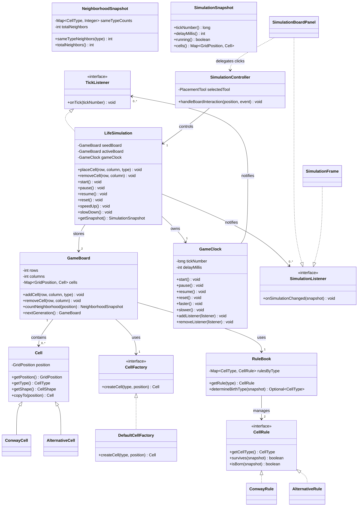

# UML Class Diagram

```mermaid
classDiagram
    class Cell {
        -GridPosition position
        +getPosition() GridPosition
        +getType() CellType
        +getShape() CellShape
        +copyTo(position) Cell
    }

    class ConwayCell
    class AlternativeCell
    Cell <|-- ConwayCell
    Cell <|-- AlternativeCell

    class CellFactory {
        <<interface>>
        +createCell(type, position) Cell
    }

    class DefaultCellFactory {
        +createCell(type, position) Cell
    }
    CellFactory <|.. DefaultCellFactory

    class CellRule {
        <<interface>>
        +getCellType() CellType
        +survives(snapshot) boolean
        +isBorn(snapshot) boolean
    }

    class ConwayRule
    class AlternativeRule
    CellRule <|.. ConwayRule
    CellRule <|.. AlternativeRule

    class RuleBook {
        -Map~CellType, CellRule~ rulesByType
        +getRule(type) CellRule
        +determineBirthType(snapshot) Optional~CellType~
    }

    class NeighborhoodSnapshot {
        -Map~CellType, Integer~ sameTypeCounts
        -int totalNeighbors
        +sameTypeNeighbors(type) int
        +totalNeighbors() int
    }

    class GameBoard {
        -int rows
        -int columns
        -Map~GridPosition, Cell~ cells
        +addCell(row, column, type) void
        +removeCell(row, column) void
        +countNeighborhood(position) NeighborhoodSnapshot
        +nextGeneration() GameBoard
    }

    class TickListener {
        <<interface>>
        +onTick(tickNumber) void
    }

    class GameClock {
        -long tickNumber
        -int delayMillis
        +start() void
        +pause() void
        +resume() void
        +reset() void
        +faster() void
        +slower() void
        +addListener(listener) void
        +removeListener(listener) void
    }
    TickListener <|.. LifeSimulation

    class SimulationListener {
        <<interface>>
        +onSimulationChanged(snapshot) void
    }

    class SimulationSnapshot {
        +tickNumber() long
        +delayMillis() int
        +running() boolean
        +cells() Map~GridPosition, Cell~
    }

    class LifeSimulation {
        -GameBoard seedBoard
        -GameBoard activeBoard
        -GameClock gameClock
        +placeCell(row, column, type) void
        +removeCell(row, column) void
        +start() void
        +pause() void
        +resume() void
        +reset() void
        +speedUp() void
        +slowDown() void
        +getSnapshot() SimulationSnapshot
    }

    class SimulationController {
        -PlacementTool selectedTool
        +handleBoardInteraction(position, event) void
    }

    class SimulationFrame
    class SimulationBoardPanel

    GameBoard "1" --> "0..*" Cell : contains
    GameBoard --> "1" CellFactory : uses
    GameBoard --> "1" RuleBook : uses
    RuleBook --> "2" CellRule : manages
    LifeSimulation --> "1" GameClock : owns
    LifeSimulation --> "2" GameBoard : stores
    LifeSimulation --> "0..*" SimulationListener : notifies
    GameClock --> "0..*" TickListener : notifies
    SimulationController --> "1" LifeSimulation : controls
    SimulationBoardPanel ..> SimulationController : delegates clicks
    SimulationBoardPanel ..|> SimulationListener
    SimulationFrame ..|> SimulationListener
```
